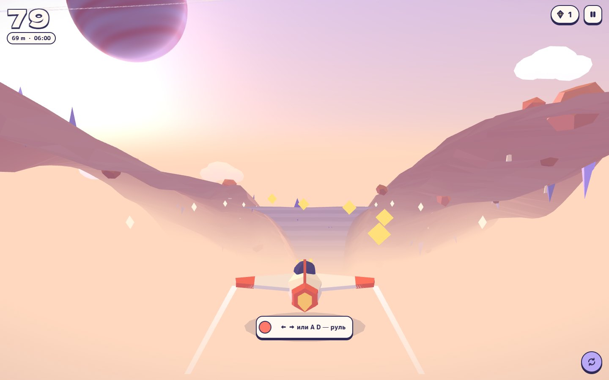
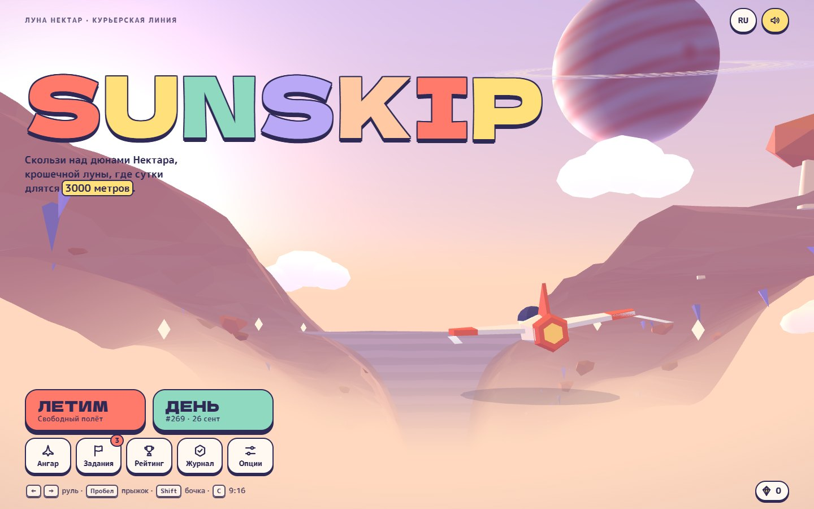
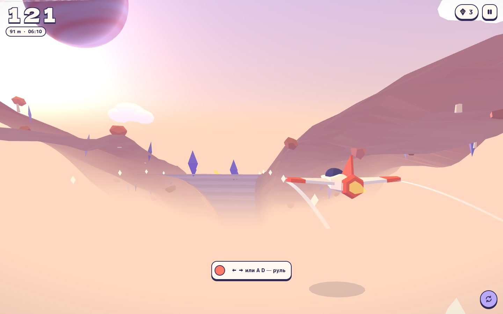
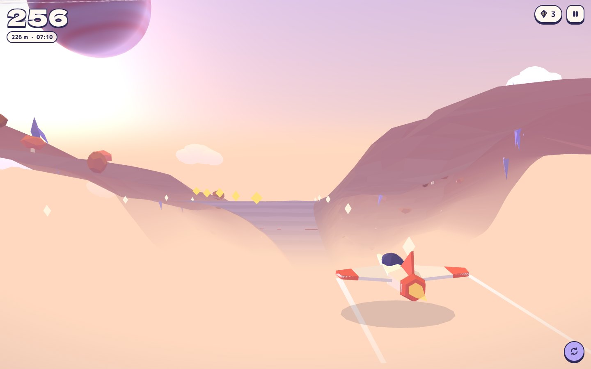
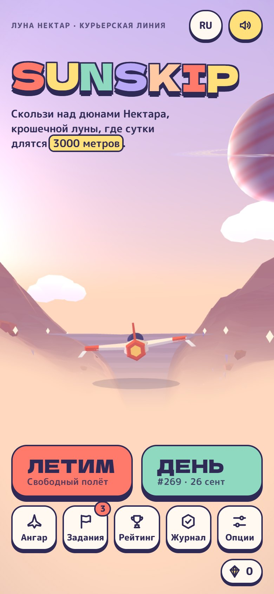
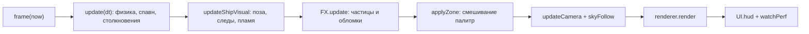

<p align="center">
  
</p>

# Sunskip — пастельный 3D-раннер над крошечной луной

> Курьер на маленьком кораблике скользит над дюнами луны Нектар, пролетает впритирку к препятствиям ради комбо и за один забег проживает целые сутки — от рассвета до лунной ночи. Игра собирается в один HTML-файл: Three.js, свои шейдеры и процедурная музыка, без игрового движка и npm-зависимостей.


**Главное:**

- **Изогнутый горизонт одной вставкой в шейдер.** Мир загибается вниз с расстоянием и плавно виляет в стороны. Формула встраивается в стандартные материалы Three.js через `onBeforeCompile`, а небо, газовый гигант с кольцами и звёзды нарисованы на GLSL без единой текстуры.
- **Музыка, которая разгоняется вместе с кораблём.** Саундтрек генерируется в Web Audio в реальном времени: бас, бочка, хэты и арпеджио вступают по мере роста скорости, в режиме FEVER арпеджио уходит на октаву вверх. Все 18 звуковых эффектов тоже синтезируются.
- **Честный «заезд дня».** Сид берётся из даты по UTC, поэтому трасса у всех игроков одинаковая. Рядом летит призрак твоей лучшей попытки, а в рантайме claude.ai работает общий рейтинг.

## Идея

Нектар — луна настолько маленькая, что сутки на ней длятся 3000 метров полёта. Игрок работает курьером: ведёт кораблик над пастельными дюнами, прыгает через гряды, делает бочки сквозь препятствия и собирает кристаллические осколки. За один забег небо проходит четыре фазы: рассвет, полдень, закат и восход луны. Вместе с ними меняется палитра всего мира — от песка до света.

Главная механика — риск ради очков. Пролететь впритирку к шпилю (GRAZE), чиркнуть брюхом по гряде (SKIM), попасть точно в центр кольца (PERFECT) — всё это копит комбо, множитель растёт до ×5 и включает FEVER. Раннер получается не про реакцию на препятствия, а про то, насколько близко ты готов к ним подлететь.

Проект показывает, как собрать законченную браузерную игру на чистом JavaScript: свой рендер-пайплайн поверх Three.js, детерминированную генерацию мира, синтез звука, прогрессию, соцсетевые фичи (фоторежим, запись 9:16, карточка результата) и адаптацию под слабые телефоны.

## Скриншоты

<table>
  <tr>
    <td width="50%" valign="top"><br><sub>Главное меню</sub></td>
    <td width="50%" valign="top"><br><sub>Прыжок через гряду</sub></td>
  </tr>
  <tr>
    <td width="50%" valign="top"><br><sub>Дальше по трассе</sub></td>
  </tr>
</table>

<p align="center">
  
  <br><sub>Мобильная версия</sub>
</p>

## Возможности

### Игровой цикл

- **Скорость растёт плавно.** Старт — 16 м/с, дальше скорость стремится к `21 + 26 × (1 − e^(−t/95))`, то есть примерно к 47 м/с через пару минут полёта.
- **Сутки на луне.** Одни сутки — `DAY_M = 3000` м, четыре зоны по 750 м: Рассвет (05:30), Полдень (11:30), Закат (17:30), Лунная ночь (23:30). Палитры смешиваются на последних 110 м зоны, в HUD идут «местные» часы, каждая новая зона встречает баннером.
- **Препятствия открываются по мере полёта.** 10 паттернов: шпили и «змейка» осколков — с 0 м, ворота — со 150 м, кольца — с 200 м, гряда — с 250 м, слалом — с 350 м, двойная гряда — с 700 м, катящиеся валуны — с 900 м, поле кристаллов с извилистым безопасным коридором — с 1200 м, ворота с грядой — с 1600 м. Веса паттернов и промежутки между ними (от 34 до 17 м) меняются до пика сложности на 6000 м.
- **Метеоритный дождь.** Первый начинается между 1500 и 1800 м, дальше — каждые 1300–1600 м: 9–15 метеоритов на 240 м трассы. Перед падением на земле растут метки. Пережил дождь — +100 очков.
- **Арки-вехи** каждые 1000 м с подписью дистанции (+50 очков).
- **Второй шанс.** После аварии дальше 150 м можно продолжить за 30 осколков (в счёт идут и собранные в этом забеге). На решение даётся 4 секунды, луна расчищает 70 м впереди. Один раз за забег.
- **Обучение.** Первый полёт — сценарий на 640 м с подсказками под тип ввода (клавиатура или касание), скорость в это время ограничена 20 м/с. Пройти обучение заново можно из настроек.

### Режимы

| Режим | Сид трассы | Что особенного |
|---|---|---|
| Свободный полёт | случайный | Рекорд устройства; флажок «твой рекорд» стоит на дистанции лучшего полёта |
| Заезд дня | `hashStr('sunskip-daily-' + дата UTC)` | Одна трасса для всех, номер заезда (№1 — 1 января 2026), счётчик попыток, призрак лучшей попытки, отдельная вкладка «Сегодня» в рейтинге |

**Ежедневные задания.** Каждый день по UTC из пула в 11 заданий выбираются три, с одним из трёх уровней сложности: собрать осколки, пролететь N метров за раз, пройти кольца, пережить метеоритный дождь и т. д. Награда — от 40 до 140 осколков, зачисляется автоматически.

### Комбо и очки

Счёт — это `floor(дистанция) + бонус`. Бонус за каждое событие умножается на текущий множитель, а в FEVER — ещё на 2.

| Событие | Бонус | Комбо |
|---|---|---|
| GRAZE — пролёт впритирку (зазор меньше 0,7 м) | 25 | +1 |
| Бочка сквозь препятствие | 25 | +1 |
| SKIM — прыжок над грядой на минимальной высоте | 10 | +1 |
| RING / PERFECT — кольцо / точно в центр (ближе 0,42 м) | 40 / 80 | +1 / +2 |
| SMASH — препятствие разбито кометой или щитом | 30 | — |
| Осколок | 10 | +1 за каждые 5 подряд |
| Прыжок через гряду | 10 | — |
| Подобранный бонус | 50 | — |
| Арка-веха | 50 | — |
| Пережитый метеоритный дождь | 100 | — |

Каждые 4 очка комбо поднимают множитель на единицу, до ×5. Окно комбо — 4 секунды. На ×5 включается **FEVER** на 7 секунд: бонусы и осколки удваиваются, мир подкрашивается золотой палитрой, в музыке появляются высокие колокольчики. Очень близкий пролёт (зазор меньше 0,45 м) на мгновение включает слоу-мо.

### Бонусы

| Бонус | Цвет | Действие |
|---|---|---|
| Магнит | коралловый | 9 секунд притягивает осколки на 16 м вперёд |
| Щит | мятный | Поглощает одно столкновение, разбивает препятствие и даёт 1,1 с неуязвимости |
| Комета | жёлтый | 4,5 секунды: скорость ×1,55, неуязвимость, всё на пути разлетается, поле зрения расширяется |

Первый бонус появляется между 420 и 620 м, дальше — каждые 620–880 м.

### Ангар

Корабли покупаются за осколки. Летают все одинаково — это чистая косметика. Каждый собирается из параметров в `buildShipMesh()`: выдавленные крылья с заданным размахом и стреловидностью, один или два киля, свой цвет следа и пламени.

| Корабль | Цена | Силуэт |
|---|---|---|
| Paper Kite · Бумажный змей | бесплатно | размах 1,25, умеренная стреловидность, один киль |
| Mint Julep · Мятный джулеп | 150 | прямое крыло, два киля |
| Lilac Moth · Сиреневая моль | 400 | самые широкие крылья (1,6), один киль |
| Coral Comet · Коралловая комета | 800 | короткие стреловидные крылья, два киля |
| Golden Hour · Золотой час | 1500 | размах 1,42, два киля |

В ангаре камера облетает корабль, и любую модель — даже ещё не купленную — можно сразу примерить на сцене.

### Прогресс

- **Кошелёк осколков.** Собранное за забег зачисляется в конце полёта.
- **Журнал пилота.** 8 счётчиков (полёты, метры, лучший счёт, самый дальний полёт, осколки, пролёты впритирку, идеальные кольца, минуты в воздухе) и 12 значков: «Первый полёт», «Километр», «Целые сутки» (3000 м), «Дальнобой» (5000 м), «На волоске», «Золотой час», «Повелитель колец», «Коллекционер», «Сова», «Метеоролог», «Постоянный клиент», «Фотограф».
- **Рейтинг.** В рантайме claude.ai — общий топ-25 за сегодня и за всё время, с именем пилота (до 14 символов; по умолчанию генерируется вроде «Мята Пилот»). Локально — десять лучших забегов на этом устройстве.

### Фото, запись и карточка результата

- **Фоторежим** (из паузы): камера вращается вокруг корабля, зум колесом или щипком. Четыре фильтра — «Как есть», «Плёнка», «Мечта», «Чернила». PNG сохраняется с подписью `SUNSKIP · дистанция · время`.
- **Режим записи 9:16** (клавиша `C`): сцена обрезается до вертикального кадра со скруглённой рамкой, HUD сокращается до счёта, появляется метка `REC · 9:16`. Удобно писать экран для Reels и Shorts.
- **Карточка результата 1080×1350.** Через 0,3 с после аварии снимается кадр, и карточка кадрирует его так, чтобы место крушения оказалось над плашкой со счётом. Карточку можно сохранить в PNG или скопировать текст результата.

### Настройки

Язык (RU/EN), громкость музыки и эффектов, вибрация (Android), графика «Авто / Низко / Высоко», «Меньше движения», контрастные препятствия, чувствительность руля (0,6–1,6), повтор обучения и сброс прогресса с подтверждением повторным нажатием.

## Как это устроено

### Модули и сборка

Исходники лежат в `src/js/` как десять файлов с номерами. `build.mjs` склеивает их по алфавиту в один `<script>`, добавляет разметку, стили и Three.js r149 с cdnjs. Бандлер и транспиляция не используются.

| Модуль | Что внутри |
|---|---|
| `00-util.js` | Хелперы, хэш `hashStr()` и ГПСЧ `mulberry()`, value noise `noise2()`, даты по UTC, сохранение (`sunskip.v1`, запись с задержкой 120 мс), словари RU/EN |
| `01-audio.js` | Объект `Sound`: планировщик музыки и синтез эффектов |
| `02-world.js` | Рендерер, шейдер изгиба, небо, газовый гигант, чанки рельефа, инстансный декор, палитры зон |
| `03-ship.js` | `SKINS`, генерация корабля, ленточные следы `Trail`, модель призрака |
| `04-entities.js` | Геометрия, пулы объектов, конструкторы сущностей, `PATTERNS`, `Spawner`, сценарий обучения |
| `05-fx.js` | Система частиц на 600 точек, обломки при аварии, проекция `toScreen()` для всплывающих надписей |
| `06-game.js` | Состояние `G`, задания, значки, жизненный цикл забега, физика, столкновения, камера, ввод, геймпад |
| `07-ui.js` | Меню, HUD, листы, пауза, второй шанс, экран итогов, фоторежим, режим 9:16, карточка результата |
| `08-net.js` | Рейтинг через `window.claude.use('db')`, сохранение файлов, буфер обмена |
| `09-main.js` | Адаптивное качество, игровой цикл `frame()`, загрузка |



### Изогнутый горизонт

Геометрия мира остаётся плоской — столкновения считаются в обычных координатах. Изгиб добавляется только при проекции, в пространстве камеры:

```glsl
float bz = min(mvPosition.z + 2.0, 0.0);
mvPosition.y -= bz * bz * uBendY;   // uBendY = 0.0019: мир уходит вниз
mvPosition.x += bz * bz * uBendX;   // uBendX = sin(dist * 0.0042) * 0.0011: плавные повороты
```

`bendify()` подменяет `#include <project_vertex>` в стандартных Lambert- и Basic-материалах через `onBeforeCompile` и задаёт `customProgramCacheKey`, чтобы Three.js не путал программы. Та же формула продублирована в шейдере частиц и в `toScreen()`: всплывающие «GRAZE» и «PERFECT» появляются ровно над изогнутым объектом.

### Процедурный мир

- **Рельеф.** 10 чанков по 24 м переиспользуются по кругу: чанк, оставшийся за камерой, перезаполняется впереди — не больше одного за кадр, чтобы время кадра не прыгало. Сетка из 26 неравномерных колонок (гуще у дороги) и 6 рядов, высота — `terrainH(x, d)` из двух октав value noise. Дорога почти плоская, края поднимаются по smoothstep. Цвет задаёт свой атрибут `aT`: тон по высоте и полосы дороги каждые 8 м.
- **Декор.** `InstancedMesh`-кольцевые буферы: 40 кристаллов, 30 валунов, 24 дерева, 44 маячка вдоль дороги, 36 облаков. Расстановка идёт из отдельного ГПСЧ с сидом забега, на низком качестве декор реже.
- **Небо.** Сфера с градиентным шейдером и солнечным диском, 520 мерцающих звёзд (`Points` со своим шейдером), газовый гигант «Apricot» с полосатой атмосферой, кольцами с щелью и маленьким спутником.
- **Палитры.** `ZONE_DEF` описывает 4 зоны по 15 цветов плюс интенсивность света. FEVER подмешивает золотую палитру на 50%, режим контрастных препятствий перекрашивает их в тёмные чернила `#3A3366`.

### Препятствия и сид дня

`Spawner` детерминирован: паттерны берутся из `mulberry(seed)`, а бонусы и метеоритные дожди — из отдельного генератора `mulberry(seed ^ 0x9e3779b9)`, чтобы их появление не сдвигало последовательность паттернов. `pickPattern()` выбирает паттерн по таблице весов `PAT_TABLE`, интерполируя вес от старта к максимальной сложности (`k = d / 6000`). Меши берутся из пулов `pooled()` / `release()`, поэтому в игровом цикле почти ничего не аллоцируется.

Заезд дня использует `hashStr('sunskip-daily-' + YYYY-MM-DD)` по UTC, задания дня — `hashStr('missions-' + день)`. Номер заезда считается от 1 января 2026 года.

### Призрак

Каждые 2 м полёта в плоский массив пишется пара `x, y`, округлённая до сантиметра. Полные сутки (3000 м) — всего 3000 чисел. Если попытка стала лучшей за день, массив сохраняется в `S.daily.ghost`. При следующем заезде полупрозрачная копия корабля летит по этим точкам с линейной интерполяцией и креном от боковой скорости. Когда запись заканчивается, призрак рассыпается частицами.

### Столкновения и «впритирку»

- **Без туннелирования.** Для каждой сущности берётся ближайшая точка отрезка, который корабль пролетел за кадр: `near = e.d − clamp(e.d, prev, dist)`. На 47 м/с и шаге до 50 мс корабль не проскакивает препятствия насквозь.
- **Шпили, колонны, столбы, валуны** — проверка круга: `dx² + near² < (r + 0.42)²`.
- **Пролёт впритирку** засчитывается, когда препятствие остаётся позади с зазором от −0,05 до 0,7 м. Для ворот порог — 0,55 м, для упавших метеоритов — 0,6 м.
- **Гряды** проверяются по высоте: ниже 0,5 м — удар, до 0,85 м — SKIM.
- **Порядок обработки удара:** комета разбивает всё, бочка и неуязвимость пропускают, щит ломается вместо корабля, иначе авария.

### Процедурная музыка

`Sound` играет петлю на 100 BPM шестнадцатыми: 128 шагов, четыре аккорда по два такта (Fmaj7 · Dm7 · B♭maj7 · C6). Планировщик срабатывает раз в 25 мс и расставляет ноты на 120 мс вперёд по часам `AudioContext`, поэтому ритм не плывёт при просадках кадров. Интенсивность — `0.32 + 0.68 × прогресс скорости`, сглаженная по шагам.

| Слой | Вступает при интенсивности |
|---|---|
| Пэд (фильтр открывается с ростом интенсивности) | всегда |
| Бас | > 0,15 |
| Бочка | > 0,3 |
| Хэты (на слабые доли, после 0,7 — восьмыми) | > 0,36 |
| Арпеджио с дилеем (после 0,82 — каждой шестнадцатой) | > 0,45 |
| Хлопок | > 0,6 |
| FEVER: арпеджио на октаву выше и колокольчики | во время FEVER |

Шины музыки и эффектов сходятся в мастер с компрессором, у музыки есть дилей на 3/16 с обратной связью 0,33 через фильтр 2600 Гц. Осколки звучат нотами пентатоники, которые поднимаются с длиной серии. Когда вкладка скрыта, `AudioContext` приостанавливается.

### Адаптивное качество и камера

- В режиме «Авто» pixel ratio — `min(dpr, 1.75) − 0.25 × drops`, но не ниже 0,75. Каждые 120 кадров игры считается FPS; если он ниже 46, качество снижается на ступень (максимум три раза), со второй ступени декор становится реже. «Низко» — pixel ratio до 1 и редкий декор, «Высоко» — до 2.
- Перед первым кадром шейдеры прогреваются через `renderer.compile()`, шаг времени ограничен 50 мс, при потере фокуса игра встаёт на паузу.
- Камера учитывает вытянутые экраны: на портретных телефонах она поднимается и отъезжает, горизонтальный угол обзора сужается с 76° до 58°, вертикальный ограничен диапазоном 52–80°. С ростом скорости обзор расширяется до +9° (+3° в режиме «Меньше движения»).

## Дизайн

- **Палитра интерфейса:** чернила `#2F2A55`, крем `#FFF3E2`, бумага `#FFF9F1`, персик `#FFC9A3`, коралл `#FF7A6B`, мята `#8FD9C1`, сирень `#B9A8F5`, масло `#FFE07A`. Верх неба по зонам: рассвет `#C4B2F0`, полдень `#93D1EA`, закат `#FF998D`, ночь `#3E3979`.
- **Типографика:** Dela Gothic One — логотип, счёт, баннеры, карточка результата; M PLUS Rounded 1c (500/700/800) — весь интерфейс. У обоих шрифтов есть кириллица.
- **Стиль:** интерфейс как набор стикеров — чернильная обводка 2,5 px, жёсткая тень `0 4px 0` вместо размытой, скругления. Логотип набран буквами пяти цветов палитры. Геометрия мира low-poly с плоским затенением (`flatGeo()`).
- **Мобильные:** учёт safe-area, отключённые жесты браузера на сцене, подсказки клавиш скрываются на сенсорных экранах, камера подстраивается под портрет.
- **Доступность:** «Меньше движения» (из системной настройки или вручную) убирает слоу-мо, тряску и линии скорости; контрастные препятствия; видимый `:focus-visible`; `aria-label` на иконках через `data-i18n-aria`; переключатели с `role="switch"`; уведомления в `aria-live`; фокус на первой кнопке в оверлеях; сообщения на случай отключённого JavaScript или недоступного WebGL.
- **Языки:** RU/EN, язык по умолчанию берётся из `navigator.language`, переключение — в меню и настройках.

## Управление

| Действие | Клавиатура | Касание | Геймпад |
|---|---|---|---|
| Руль | `←` `→` / `A` `D` | вести пальцем | левый стик, крестовина |
| Прыжок | `Пробел` / `↑` / `W` | тап, свайп вверх, тап вторым пальцем | A |
| Бочка | `Shift` / `↓` / `S` | свайп вниз | B или X |
| Пауза | `P` / `Esc` | кнопка в HUD | Start |
| Режим записи 9:16 | `C` | кнопка в паузе | — |
| Звук вкл/выкл | `M` | кнопка в меню | — |
| Ещё раз после аварии | `Пробел` / `Enter` | кнопка | A |
| Фоторежим | из паузы, `Esc` — выход | тянуть — вращать, щипок — зум | — |

В меню кнопка A геймпада запускает свободный полёт.

## Стек

| Технология | Версия | Для чего |
|---|---|---|
| Three.js | r149 (0.149.0, cdnjs) | WebGL-рендер, геометрия, `InstancedMesh`, `Points` |
| GLSL | — | Изгиб горизонта, небо, звёзды, газовый гигант, рельеф, частицы |
| Web Audio API | — | Процедурная музыка и синтез эффектов |
| Gamepad API | — | Управление с геймпада |
| Canvas 2D | — | Карточка результата, фото с подписью, надписи на арках |
| Vibration API | — | Тактильный отклик на Android |
| localStorage | — | Прогресс, настройки, призрак дня |
| claude.ai artifact runtime | — | Общий рейтинг (`db`, `user`) и сохранение файлов (`downloads`) |
| Google Fonts | — | Dela Gothic One, M PLUS Rounded 1c |
| Node.js | 16+ | `build.mjs` на встроенных `node:fs` и `node:path` |

## Структура проекта

```
sunskip/
├── src/
│   ├── body.html          — разметка: SVG-спрайт иконок, HUD, меню, оверлеи, фоторежим, загрузчик
│   ├── style.css          — интерфейс: токены, кнопки-стикеры, HUD, листы, режим 9:16
│   └── js/
│       ├── 00-util.js     — хелперы, ГПСЧ, шум, даты, сохранение, RU/EN
│       ├── 01-audio.js    — процедурная музыка и звуковые эффекты
│       ├── 02-world.js    — рендерер, шейдер изгиба, небо, рельеф, декор, зоны
│       ├── 03-ship.js     — корабли, следы, призрак
│       ├── 04-entities.js — препятствия, пулы, паттерны, спавнер, обучение
│       ├── 05-fx.js       — частицы, обломки, всплывающие надписи
│       ├── 06-game.js     — правила, физика, столкновения, камера, ввод
│       ├── 07-ui.js       — экраны, листы, фоторежим, карточка результата
│       ├── 08-net.js      — рейтинг, сохранение файлов, буфер обмена
│       └── 09-main.js     — адаптивное качество, игровой цикл, загрузка
├── build.mjs              — склеивает src/ в index.html и dist/artifact.html
├── index.html             — готовая игра одним файлом (около 195 КБ)
└── dist/artifact.html     — версия для claude.ai без обёртки документа (создаётся сборкой, в .gitignore)
```

## Запуск

Готовая игра уже лежит в `index.html` — её достаточно открыть в браузере. Нужен интернет: Three.js и шрифты грузятся с CDN.

После правок в `src/` пересоберите страницу:

```bash
node build.mjs
```

`npm install` не нужен: сборщик использует только встроенные модули Node.js. Команда перезаписывает `index.html` и создаёт `dist/artifact.html`. Если браузер ограничивает страницы, открытые с диска, подойдёт любой статический сервер, например `python -m http.server`.

> Общий рейтинг работает только в рантайме артефактов claude.ai (`dist/artifact.html`). Локально вместо него показываются лучшие забеги на этом устройстве.

---

Концепт для портфолио. Луна Нектар, курьерская линия и корабли выдуманы.
